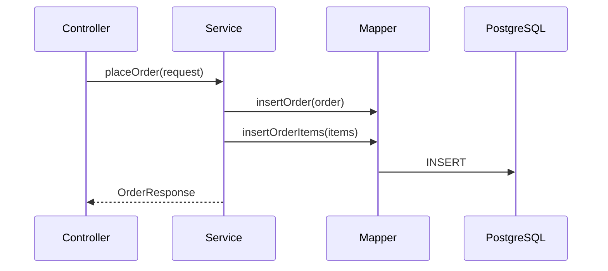

# Order Service Roadmap: Spring Boot + MyBatis + PostgreSQL

2026-09-19 · @Someone

This roadmap sequences the work for two REST endpoints — placing an order and checking order status — on Spring Boot, PostgreSQL, and MyBatis. Each step lists what to build and the concept it teaches, in the order you'd actually write it, from schema to tests.

## Step 1: Design the Data Model

Start with the database, not the Java code — the schema shapes every layer above it. Two tables cover both services: placing an order writes to both, checking status only reads `orders`.

### orders

| Column | Type | Purpose |
| --- | --- | --- |
| id | BIGSERIAL | Primary key, auto-generated |
| customer\_id | BIGINT | Who placed the order |
| status | VARCHAR(20) | Current state — kept as text so new values don't need a migration |
| total | NUMERIC(10,2) | Order total; NUMERIC avoids floating-point rounding on money |
| created\_at | TIMESTAMP | When the order was placed |

### order\_items

| Column | Type | Purpose |
| --- | --- | --- |
| id | BIGSERIAL | Primary key |
| order\_id | BIGINT | Foreign key to orders.id |
| product\_id | BIGINT | Which product was ordered |
| quantity | INT | How many units |
| price | NUMERIC(10,2) | Price at the time of order — not looked up later, so a later price change doesn't rewrite history |

Add an index on `order_id` — both the status check and any future "view my order" query filter by it.

```sql
CREATE TABLE orders (
  id BIGSERIAL PRIMARY KEY,
  customer_id BIGINT NOT NULL,
  status VARCHAR(20) NOT NULL,
  total NUMERIC(10,2) NOT NULL,
  created_at TIMESTAMP NOT NULL DEFAULT now()
);

CREATE TABLE order_items (
  id BIGSERIAL PRIMARY KEY,
  order_id BIGINT NOT NULL REFERENCES orders(id),
  product_id BIGINT NOT NULL,
  quantity INT NOT NULL,
  price NUMERIC(10,2) NOT NULL
);

CREATE INDEX idx_order_items_order_id ON order_items(order_id);
```

### Try it before writing any Java

Run the DDL, then insert and query by hand — confirming the schema works on its own makes the mapper layer much easier to debug later.

```sql
psql -d ecommerce -f schema.sql

INSERT INTO orders (customer_id, status, total)
VALUES (1, 'PLACED', 39.98)
RETURNING id;

INSERT INTO order_items (order_id, product_id, quantity, price)
VALUES (1, 501, 2, 19.99);

SELECT status FROM orders WHERE id = 1;
```

## Step 2: Scaffold the Spring Boot Project

Generate the project at start.spring.io (or your IDE's wizard): Maven, Java 17+, packaging Jar. Add these dependencies:

- spring-boot-starter-web — REST + embedded Tomcat
- mybatis-spring-boot-starter — MyBatis integration
- postgresql — JDBC driver
- spring-boot-starter-validation — request validation

```xml
<dependencies>
  <dependency>
    <groupId>org.springframework.boot</groupId>
    <artifactId>spring-boot-starter-web</artifactId>
  </dependency>
  <dependency>
    <groupId>org.mybatis.spring.boot</groupId>
    <artifactId>mybatis-spring-boot-starter</artifactId>
    <version>3.0.3</version>
  </dependency>
  <dependency>
    <groupId>org.postgresql</groupId>
    <artifactId>postgresql</artifactId>
    <scope>runtime</scope>
  </dependency>
  <dependency>
    <groupId>org.springframework.boot</groupId>
    <artifactId>spring-boot-starter-validation</artifactId>
  </dependency>
</dependencies>
```

### Configure the datasource and MyBatis

```yaml
server:
  port: 8080
spring:
  datasource:
    url: jdbc:postgresql://localhost:5432/ecommerce
    username: app
    password: ${DB_PASSWORD}
mybatis:
  mapper-locations: classpath:mappers/*.xml
  type-aliases-package: com.acme.order.domain
  configuration:
    map-underscore-to-camel-case: true
```

`map-underscore-to-camel-case` matters here: your columns are `order_id` and `customer_id`, your Java fields will be `orderId` and `customerId`, and this setting lets MyBatis match them without extra mapping.

### Create the entry point

```java
@SpringBootApplication
public class CatalogApplication {
    public static void main(String[] args) {
        SpringApplication.run(CatalogApplication.class, args);
    }
}
```

### Try it before writing any endpoints

Run `mvn spring-boot:run` (or your IDE's run button). Confirm the log shows Tomcat starting on port 8080 with no datasource errors — that means Postgres and MyBatis are both wired correctly before any business logic exists.

## Step 3: Define Domain Classes and DTOs

Keep your database model separate from what the API exposes.

- Domain: `Order`, `OrderItem`, an `OrderStatus` enum (`PLACED`, `SHIPPED`, `DELIVERED`, `CANCELLED`)
- Request: `PlaceOrderRequest` (customer id, list of items)
- Response: `OrderResponse`, `OrderStatusResponse`

This separation lets you change the database shape later without breaking the API contract.

### What This Looks Like in Code

```java
public class Order {
    private Long id;
    private Long customerId;
    private OrderStatus status;
    private BigDecimal total;
    private Instant createdAt;
    private List<OrderItem> items;
    // getters and setters
}

public class OrderItem {
    private Long id;
    private Long orderId;
    private Long productId;
    private int quantity;
    private BigDecimal price;
    // getters and setters
}
```

```java
public class PlaceOrderRequest {
    @NotNull
    private Long customerId;

    @NotEmpty
    private List<@Valid OrderItemRequest> items;
    // getters and setters
}

public class OrderItemRequest {
    @NotNull
    private Long productId;

    @Min(1)
    private int quantity;
    // getters and setters
}

public class OrderResponse {
    private Long orderId;
    private OrderStatus status;
    private BigDecimal total;
    // getters and setters
}

public class OrderStatusResponse {
    private Long orderId;
    private OrderStatus status;
    // getters and setters
}
```

Group by responsibility: `domain` holds `Order`, `OrderItem`, `OrderStatus`; `web` holds the request and response classes. The validation annotations (`@NotNull`, `@NotEmpty`, `@Min`) only take effect once the Step 6 controller marks the parameter `@Valid`.

## Step 4: Learn the MyBatis Mapping Layer

This is the biggest shift from a typical Spring Data JPA tutorial: MyBatis maps hand-written SQL to Java objects, instead of generating SQL from an entity model.

|  | Spring Data JPA | MyBatis |
| --- | --- | --- |
| SQL | Generated for you | You write it |
| Control | Less | Full control over every query |
| Mapping | Annotations on entities | XML or annotated mapper interfaces |
| Best fit | Simple CRUD | Complex joins, reporting, tuned queries |

### The mapper interface

```java
public interface OrderMapper {
    void insertOrder(Order order);
    void insertOrderItems(List<OrderItem> items);
    Order findOrderById(Long id);
    String findOrderStatusById(Long id);
}
```

Spring Boot finds this automatically once `mybatis-spring-boot-starter` is on the classpath and the interface sits under a package MyBatis scans — add `@MapperScan("com.acme.order.mapper")` to `CatalogApplication` from Step 2 if it isn't picked up on its own.

### The XML mapping

```xml
<?xml version="1.0" encoding="UTF-8"?>
<!DOCTYPE mapper PUBLIC "-//mybatis.org//DTD Mapper 3.0//EN" "http://mybatis.org/dtd/mybatis-3-mapper.dtd">
<mapper namespace="com.acme.order.mapper.OrderMapper">

  <insert id="insertOrder" useGeneratedKeys="true" keyProperty="id">
    INSERT INTO orders (customer_id, status, total)
    VALUES (#{customerId}, #{status}, #{total})
  </insert>

  <insert id="insertOrderItems">
    INSERT INTO order_items (order_id, product_id, quantity, price)
    VALUES
    <foreach collection="list" item="item" separator=",">
      (#{item.orderId}, #{item.productId}, #{item.quantity}, #{item.price})
    </foreach>
  </insert>

  <resultMap id="orderResultMap" type="Order">
    <id property="id" column="id"/>
    <result property="customerId" column="customer_id"/>
    <result property="status" column="status"/>
    <result property="total" column="total"/>
    <result property="createdAt" column="created_at"/>
    <collection property="items" ofType="OrderItem" select="findItemsByOrderId" column="id"/>
  </resultMap>

  <select id="findOrderById" resultMap="orderResultMap">
    SELECT * FROM orders WHERE id = #{id}
  </select>

  <select id="findItemsByOrderId" resultType="OrderItem">
    SELECT * FROM order_items WHERE order_id = #{orderId}
  </select>

  <select id="findOrderStatusById" resultType="string">
    SELECT status FROM orders WHERE id = #{id}
  </select>

</mapper>
```

`useGeneratedKeys` plus `keyProperty="id"` writes the database-generated id straight back onto your `Order` object after the insert — that's how the service layer in Step 5 gets an id to attach to the order items.

### Try it before writing the service

A `@MybatisTest` slice test checks the SQL actually works, without pulling in the whole web layer:

```java
@MybatisTest
class OrderMapperTest {
    @Autowired
    OrderMapper orderMapper;

    @Test
    void insertsAndReadsBackAnOrder() {
        Order order = new Order();
        order.setCustomerId(1L);
        order.setStatus("PLACED");
        order.setTotal(new BigDecimal("39.98"));

        orderMapper.insertOrder(order);

        assertThat(orderMapper.findOrderStatusById(order.getId())).isEqualTo("PLACED");
    }
}
```

## Step 5: Write the Service Layer

`OrderService` owns the business logic the controller and mapper shouldn't:

- `placeOrder(request)` — builds the `Order` and its `OrderItem`s, saves both, sets the initial status to `PLACED`
- `getOrderStatus(orderId)` — looks up the status by id, throwing a not-found exception if it doesn't exist

Mark `placeOrder` `@Transactional` — it writes to two tables, and both inserts need to succeed or roll back together.



### The implementation

```java
@Service
public class OrderService {
    private final OrderMapper orderMapper;

    public OrderService(OrderMapper orderMapper) {
        this.orderMapper = orderMapper;
    }

    @Transactional
    public OrderResponse placeOrder(PlaceOrderRequest request) {
        List<OrderItem> items = toOrderItems(request.getItems());

        Order order = new Order();
        order.setCustomerId(request.getCustomerId());
        order.setStatus(OrderStatus.PLACED.name());
        order.setTotal(sumTotal(items));

        orderMapper.insertOrder(order);                       // id is generated and set back onto `order`
        items.forEach(item -> item.setOrderId(order.getId()));
        orderMapper.insertOrderItems(items);

        return new OrderResponse(order.getId(), OrderStatus.PLACED, order.getTotal());
    }

    public OrderStatusResponse getOrderStatus(Long orderId) {
        String status = orderMapper.findOrderStatusById(orderId);
        if (status == null) {
            throw new OrderNotFoundException(orderId);
        }
        return new OrderStatusResponse(orderId, OrderStatus.valueOf(status));
    }

    private List<OrderItem> toOrderItems(List<OrderItemRequest> requested) {
        return requested.stream().map(req -> {
            OrderItem item = new OrderItem();
            item.setProductId(req.getProductId());
            item.setQuantity(req.getQuantity());
            item.setPrice(priceLookup.currentPriceFor(req.getProductId())); // never trust a client-supplied price
            return item;
        }).toList();
    }

    private BigDecimal sumTotal(List<OrderItem> items) {
        return items.stream()
                .map(i -> i.getPrice().multiply(BigDecimal.valueOf(i.getQuantity())))
                .reduce(BigDecimal.ZERO, BigDecimal::add);
    }
}
```

`priceLookup` stands in for wherever your real price comes from — a product catalog service or table. Pricing happens on the server, never from the request body, so a client can't place an order at a price they typed in themselves.

### The not-found exception

```java
public class OrderNotFoundException extends RuntimeException {
    public OrderNotFoundException(Long orderId) {
        super("Order not found: " + orderId);
    }
}
```

Step 7 turns this into a proper `404` response.

## Step 6: Build the REST Controller

Two endpoints, one controller:

- `POST /api/orders` — accepts a `PlaceOrderRequest`, returns the created order with `201 Created`
- `GET /api/orders/{orderId}/status` — returns the current status

```java
@RestController
@RequestMapping("/api/orders")
public class OrderController {
    private final OrderService orderService;

    public OrderController(OrderService orderService) {
        this.orderService = orderService;
    }

    @PostMapping
    @ResponseStatus(HttpStatus.CREATED)
    public OrderResponse placeOrder(@RequestBody @Valid PlaceOrderRequest request) {
        return orderService.placeOrder(request);
    }

    @GetMapping("/{orderId}/status")
    public OrderStatusResponse getStatus(@PathVariable Long orderId) {
        return orderService.getOrderStatus(orderId);
    }
}
```

### Why each annotation is there

- `@RestController` — every method returns JSON, not a view name
- `@RequestMapping("/api/orders")` — the shared base path for both endpoints below it
- `@PathVariable Long orderId` — pulled straight out of the URL: `/api/orders/42/status` → `orderId = 42`
- `@RequestBody @Valid PlaceOrderRequest` — deserializes the JSON body and runs the Bean Validation annotations from Step 3 before the method body even runs

If validation fails, Spring throws `MethodArgumentNotValidException` before `placeOrder` ever executes — Step 7's `@RestControllerAdvice` turns that into the `400` response.

### The controller stays thin

There's no business logic here — no status calculation, no database access. That all lives in `OrderService` from Step 5. If a bug shows up in what gets saved, look there first; if a bug shows up in the HTTP shape (wrong status code, wrong path), look here.

## Step 7: Handle Errors Properly

One `@RestControllerAdvice` class covers both endpoints:

- Order not found (`OrderNotFoundException` from Step 5) → `404` with a clear error body
- Invalid request body (`@Valid` failure) → `400` listing which fields failed

This keeps the controller methods free of try/catch and gives callers a consistent error shape.

### The error response shape

```java
public record ErrorResponse(String code, String message) {}
```

### The advice

```java
@RestControllerAdvice
public class ApiExceptionHandler {

    @ExceptionHandler(OrderNotFoundException.class)
    @ResponseStatus(HttpStatus.NOT_FOUND)
    public ErrorResponse handleNotFound(OrderNotFoundException ex) {
        return new ErrorResponse("ORDER_NOT_FOUND", ex.getMessage());
    }

    @ExceptionHandler(MethodArgumentNotValidException.class)
    @ResponseStatus(HttpStatus.BAD_REQUEST)
    public ErrorResponse handleInvalid(MethodArgumentNotValidException ex) {
        String detail = ex.getBindingResult().getFieldErrors().stream()
                .map(e -> e.getField() + " " + e.getDefaultMessage())
                .collect(Collectors.joining(", "));
        return new ErrorResponse("INVALID_REQUEST", detail);
    }
}
```

### What callers see

```json
// GET /api/orders/999/status -> 404
{ "code": "ORDER_NOT_FOUND", "message": "Order not found: 999" }

// POST /api/orders with quantity: 0 -> 400
{ "code": "INVALID_REQUEST", "message": "items[0].quantity must be greater than or equal to 1" }
```

`@RestControllerAdvice` applies across every controller in the application — you write this once, not per endpoint.

## Step 8: Test It

- Manual: `curl` or Postman against the running app — place an order, then check its status
- Unit: test `OrderService` with Mockito, mocking `OrderMapper`
- Integration: Testcontainers running real PostgreSQL, to verify the SQL in `OrderMapper.xml` actually works against Postgres — not just an in-memory substitute

Automated tests matter more with MyBatis than JPA — there's no framework guaranteeing your hand-written SQL is correct.

### Manual: curl

```bash
curl -X POST localhost:8080/api/orders \
  -H "Content-Type: application/json" \
  -d '{"customerId": 1, "items": [{"productId": 501, "quantity": 2}]}'

curl localhost:8080/api/orders/1/status
```

### Unit test: OrderService

```java
@ExtendWith(MockitoExtension.class)
class OrderServiceTest {
    @Mock OrderMapper orderMapper;
    @InjectMocks OrderService orderService;

    @Test
    void returnsStatusWhenOrderExists() {
        when(orderMapper.findOrderStatusById(1L)).thenReturn("PLACED");

        var response = orderService.getOrderStatus(1L);

        assertThat(response.status()).isEqualTo(OrderStatus.PLACED);
    }

    @Test
    void throwsWhenOrderMissing() {
        when(orderMapper.findOrderStatusById(99L)).thenReturn(null);

        assertThrows(OrderNotFoundException.class, () -> orderService.getOrderStatus(99L));
    }
}
```

### Integration test: real PostgreSQL via Testcontainers

```java
@SpringBootTest
@Testcontainers
class OrderMapperIntegrationTest {
    @Container
    static PostgreSQLContainer<?> postgres = new PostgreSQLContainer<>("postgres:16");

    @DynamicPropertySource
    static void datasourceProps(DynamicPropertyRegistry registry) {
        registry.add("spring.datasource.url", postgres::getJdbcUrl);
        registry.add("spring.datasource.username", postgres::getUsername);
        registry.add("spring.datasource.password", postgres::getPassword);
    }

    @Autowired
    OrderMapper orderMapper;

    @Test
    void insertOrderItemsWritesAllRows() {
        // exercises the real foreach-generated INSERT against real Postgres
    }
}
```

This is the test that would catch a typo in the `<foreach>` block from Step 4 — an in-memory stand-in wouldn't.

## Step 9: Polish and Next Steps

Once both endpoints work end-to-end, these solve problems you'll hit once real traffic shows up — not before.

### Pagination

Once you add "list my orders," don't return every row at once:

```java
@GetMapping
public Page<OrderResponse> listOrders(@RequestParam Long customerId, Pageable pageable) {
    return orderService.findByCustomer(customerId, pageable);
}
```

MyBatis doesn't give you `Pageable` support for free the way Spring Data JPA does — you'll pass `limit`/`offset` into your own `<select>` and a matching count query.

### Structured logging

Log around order placement with the order id attached, so a support ticket traces straight to the right log lines:

```java
log.info("order.placed orderId={} customerId={} total={}", order.getId(), order.getCustomerId(), order.getTotal());
```

### Health checks with Actuator

Add `spring-boot-starter-actuator` and you get `/actuator/health` for free — point your load balancer or orchestrator at it before this ships anywhere real.

### Optimistic locking

If order status can be updated concurrently (a fulfillment job and a cancellation request racing each other), add a `version` column:

```sql
ALTER TABLE orders ADD COLUMN version INT NOT NULL DEFAULT 0;
```

```xml
<update id="updateStatus">
  UPDATE orders
  SET status = #{newStatus}, version = version + 1
  WHERE id = #{id} AND version = #{expectedVersion}
</update>
```

If the update affects zero rows, someone else changed the order first — reload and retry, or surface a conflict to the caller.
